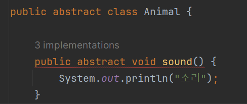
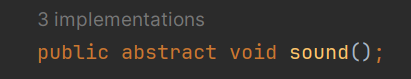

# Abstract (추상)
## 추상 클래스와 추상메서드
### 상속을 이용하다보면 가장 상위 클래스가 실상 사용되지 않는 경우가 있다. 그럴때 대신하여 추상클래스와 추상메서드를 이용한다.

#### 예를들면

Animal 이라는 큰 상위클래스를 상속받는
Cat,Dog,Pig,Caw 등 하위클라스에서는 각자의 특성,기능 등이 존재하고 사용되어지지만 정작 부모클래스인 animal에는 따로 사용되지 않는다. 이때 class 앞에 abstract를 붙여 animal을 추상 클래스로 이용하면 혹여나 기능이 따로 쓰이지 않는 animal 클래스를 생성하여 사용을 할 수 조차 없게 된다.

그리고 그 안에는 오버라이딩에 이용될 추상 메서드들도 있다.

예를들면 동물들의 각자의 울음소리를 내는 메서드인 Sound를 만들고 오버라이딩하여 각자의 동물 클라스에서 소리를 오버라이딩하여 사용한다.
하지만 Animal에서의 Sound 메서드는 따로 소리가 없으니 이때 abstract로 추상메서드로 만들어준다.
그러므로 추상메서드에는 기능이 없음으로 바디또한 존재할 수 없고 존재하면 에러가 난다.

#### 추상메서드를 하나라도 가지고있는 클라스는 모두 추상클래스로 선언해야한다.

자식 클래스는 부모클래스인 추상클래스의 해당 메서드를 반드시 오버라이딩 해야한다는 제약이 추가된다.

## 정리
- 추상 클래스로인해 실수로 인스턴스를 생성하는 문제를 방지
- 모든 추상 메서드를 무조건 오버라이딩을 해야함으로 까먹거나 다른 메서드를 오버라이딩 해버리는 문제를 방지 
- 다형성을 위한 클래스일 뿐

