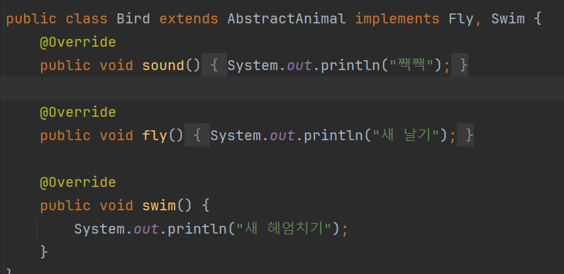

# Interface(인터페이스)
## 인터페이스는 상속과 비슷한 기능이지만 조금더 제한적이고 다중기능 까지 더해진 클래스(?)이다.

- 클래스 이름 뒤에 상속인 `extends` 대신 `implements`를 쓴다.
- `implements` 뒤에는 구현(상속)받을 상위 클래스를 1개 이상 할 수 있다.(다중구현) 

- 메서드는 기본적으로 앞에 `public abstract`가 적용되며 생략한다(권장)

- 추상 클래스와는 다르게 다른 메서드를 넣을 수 없다. (순수 추상클래스처럼 오버라이딩 전용 메서드만 존재 해야한다.)

- 인터페이스에서 변수 멤버(필드?) 변수는 `public static final`이 모두 붙기때문에 변수명은 대문자로 쓰며 _를 단어 사이에 넣어 작성하며 `public static final` 는 기본 생략한다.(권장)

## 정리
### 기본적인 기능은 추상클래스와 비슷하지만 더 제한적이다. 아직은 두개를 어떨때 사용하는게 맞는 상황인지는 더욱 다양한 환경을 맞닥뜨려봐야 알 것 같다.!